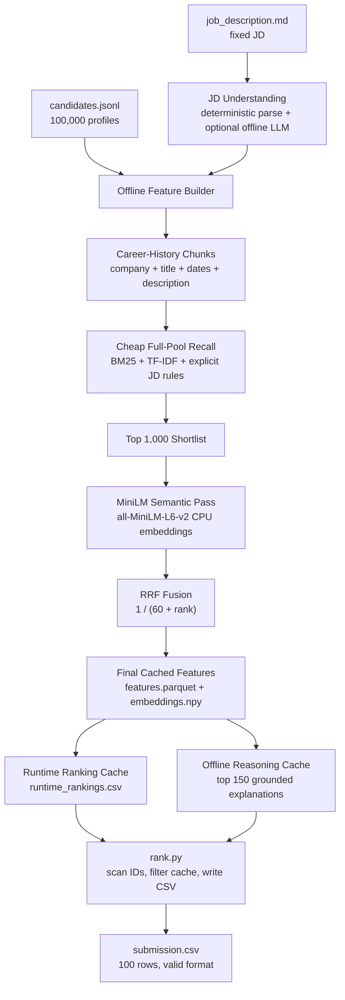
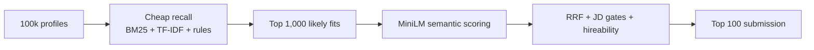

# Pramaan

Production-style candidate discovery for the Redrob Intelligent Candidate Discovery & Ranking Challenge.


## Executive Summary

Pramaan ranks 100,000 Redrob candidates for the Senior AI Engineer founding-team JD with a two-phase architecture. The offline phase does the expensive work: career-history feature extraction, BM25, cheap full-pool recall, two-stage `all-MiniLM-L6-v2` semantic scoring on the top 1,000 shortlist, JD Fit Gate penalties, Redrob hireability modifiers, and grounded reasoning generation. The timed phase is intentionally small: `rank.py` scans candidate IDs, reads the pre-sorted runtime cache, attaches cached reasonings, and writes the required 100-row CSV.

The design follows the JD's main warning: **career-history evidence beats skills-keyword stuffing**. A profile that shipped ranking, search, recommendation, retrieval, or evaluation systems is favored over a candidate with fashionable AI terms but unrelated work.

## Current Submission Status

| Item | Status |
| --- | --- |
| Final CSV | `submission.csv` generated |
| Organizer validator | Passing |
| Timed ranking step | 2.31 seconds on the full 100,000-candidate file |
| Offline dense model | Two-stage `all-MiniLM-L6-v2` on top 1,000 shortlist |
| Full-pool recall | BM25 + TF-IDF + JD/rule features |
| Reasoning cache | 150 candidates |
| Network in `rank.py` | None |
| GPU in `rank.py` | None |
| Sandbox app | Streamlit small-sample app included |

## Submission Deliverables

| Deliverable | Ready? | Notes |
| --- | --- | --- |
| Ranking upload | Yes | Submit `submission.csv`; the spec requires CSV, not JSON. |
| Portal metadata | Needs final personal fields | `submission_metadata.yaml` mirrors the portal fields, but team/contact and sandbox URL must be filled before upload. |
| GitHub repository | Yes | `https://github.com/Ajey95/pramaan-redrob-ranker` |
| Sandbox/demo link | Hosted app required | Streamlit Cloud should use `streamlit_app.py`; paste the final app URL into the portal and metadata file. |
| Code reproduction command | Yes | `python rank.py --candidates ./candidates.jsonl --out ./submission.csv` |

No separate ranking JSON is required by the organizer spec. The JSON files in `cache/` are internal validated reproduction artifacts:

| JSON artifact | Status | Purpose |
| --- | --- | --- |
| `cache/jd_structured.json` | Validated | Structured fixed-JD criteria used by the offline pipeline |
| `cache/feature_manifest.json` | Validated | Feature-cache provenance for the 100,000-candidate run |
| `cache/reasoning_cache.json` | Validated | Grounded reasonings for the top 150 safety margin |

## System Architecture



## Offline vs Timed Responsibilities

| Phase | File | Responsibility | LLM/API allowed? |
| --- | --- | --- | --- |
| Offline | `offline/jd_understanding.py` | Parse fixed JD into structured criteria | Optional, fallback deterministic |
| Offline | `offline/precompute_features.py` | Build full-pool recall, MiniLM shortlist embeddings, JD gates, final scores | No hosted LLM needed |
| Offline | `offline/generate_reasoning.py` | Generate grounded top-150 reasonings | Optional, fallback deterministic |
| Timed | `rank.py` | Scan candidate IDs, filter pre-sorted runtime cache, write CSV | Never |

## Reproduction

Install dependencies in Python 3.12:

```bash
python -m venv .venv312
.venv312/Scripts/python -m pip install -r requirements.txt
```

Run the full offline build:

```bash
.venv312/Scripts/python offline/jd_understanding.py \
  --jd data/job_description.md \
  --out cache/jd_structured.json

HF_HUB_OFFLINE=1 TRANSFORMERS_OFFLINE=1 .venv312/Scripts/python offline/precompute_features.py \
  --candidates ../India_runs_data_and_ai_challenge/candidates.jsonl \
  --out cache/features.parquet \
  --manifest cache/feature_manifest.json \
  --preview cache/preview_top.csv \
  --runtime-rankings cache/runtime_rankings.csv \
  --dense-backend two-stage-minilm \
  --embedding-model all-MiniLM-L6-v2 \
  --embeddings-out cache/embeddings.npy \
  --embedding-batch-size 512 \
  --minilm-shortlist-size 1000

.venv312/Scripts/python offline/generate_reasoning.py \
  --candidates ../India_runs_data_and_ai_challenge/candidates.jsonl \
  --features cache/features.parquet \
  --out cache/reasoning_cache.json \
  --top-n 150
```

Run the timed submission step:

```bash
.venv312/Scripts/python rank.py \
  --candidates ../India_runs_data_and_ai_challenge/candidates.jsonl \
  --out submission.csv

.venv312/Scripts/python validate_submission.py submission.csv
```

Expected validator output:

```text
Submission is valid.
```

Latest local timing on the full released 100,000-row `candidates.jsonl`:

```text
rank_seconds=2.31
Submission is valid.
```

## Why Two-Stage MiniLM

Full-pool MiniLM over 100,000 long profiles is unnecessarily slow on CPU. The practical production pattern is retrieval cascade:



This keeps semantic scoring focused where it matters while preserving full-pool recall. The timed `rank.py` performs no model inference and does not import pandas or pyarrow.

## Scoring Formula

```text
final_score =
  jd_fit_gate_score
  * skill_match_score
  * hireability_modifier
  * consistency_modifier
```

`skill_match_score` combines:

| Component | Purpose |
| --- | --- |
| BM25 / TF-IDF RRF | broad full-pool recall |
| MiniLM shortlist RRF | semantic precision on plausible candidates |
| Career evidence | shipped ranking/search/retrieval/recommendation systems |
| Title fit | senior ML/AI/NLP/search/recommendation role alignment |
| Experience fit | soft preference around 5-9 years |
| Location fit | Pune/Noida/India/relocation alignment |

`hireability_modifier` uses Redrob signals as a multiplier: recruiter response rate, interview completion, offer acceptance, open-to-work status, recent activity, notice period, recruiter saves/search appearances, and GitHub activity.

## JD Fit Gate Rules

| Rule | Action | JD Rationale |
| --- | --- | --- |
| Pure research without production deployment | Near-zero | JD says Redrob will not move forward |
| Consulting/services-only career | Near-zero | JD explicitly rejects services-only backgrounds |
| Recent LangChain/OpenAI-only AI work | Heavy penalty | JD wants pre-LLM retrieval/ranking depth |
| Non-coding architecture/management role | Heavy penalty | JD says this role writes code |
| Title-chasing short-tenure pattern | Moderate penalty | JD wants someone likely to stay |
| Framework keywords without shipped depth | Moderate penalty | JD rejects framework enthusiasm over systems thinking |
| CV/speech/robotics without NLP/IR | Moderate penalty | JD explicitly says this is not the target |
| Far outside 5-9 year band | Soft penalty | JD says flexible, but ideal is roughly 6-8 years |

## Cached Artifacts

| Artifact | Purpose |
| --- | --- |
| `cache/features.parquet` | full candidate feature table and final scores |
| `cache/runtime_rankings.csv` | pre-sorted candidate IDs and scores consumed by `rank.py` |
| `cache/embeddings.npy` | MiniLM embeddings for the shortlist |
| `cache/embeddings.ids.json` | candidate IDs corresponding to shortlist embeddings |
| `cache/reasoning_cache.json` | grounded reasoning for top 150 |
| `cache/feature_manifest.json` | reproducibility metadata |
| `cache/preview_top.csv` | manual top-candidate inspection file |

Current manifest excerpt:

```json
{
  "dense_backend": "two_stage_minilm",
  "embedding_model": "all-MiniLM-L6-v2",
  "candidate_count": 100000
}
```

## Manual QA Evidence

Top ranks after two-stage MiniLM are dominated by direct search/retrieval/recommendation candidates:

| Rank | Candidate | Title | Why it fits |
| --- | --- | --- | --- |
| 1 | `CAND_0079387` | AI Engineer | recommendation systems, vector search, production retrieval evidence |
| 2 | `CAND_0041669` | Recommendation Systems Engineer | ranking layer, FAISS/Milvus, Noida location |
| 3 | `CAND_0055905` | Senior ML Engineer | semantic search migration, hybrid retrieval, ranking evaluation |
| 4 | `CAND_0046525` | Senior ML Engineer | Pune, embedding ranker, BM25 + dense retrieval, recruiter search product |
| 5 | `CAND_0060054` | AI Engineer | semantic search plus recommendation-system career history |

The earlier sample ranking surfaced unrelated Marketing/HR/Mechanical profiles because of AI-looking skills. The current JD Fit Gate down-weights unrelated current titles unless career history has shipped ranking/search/retrieval evidence.

## Sandbox

The sandbox is for small-sample reproducibility, not full 100k scoring.

```bash
streamlit run sandbox/app.py
```

It accepts up to 100 candidates as JSON or JSONL and returns a ranked CSV with the same columns as the official submission.

For Streamlit Community Cloud, deploy this repository with:

| Setting | Value |
| --- | --- |
| Repository | `Ajey95/pramaan-redrob-ranker` |
| Branch | `master` |
| Main file path | `streamlit_app.py` |

`streamlit_app.py` is a thin root entrypoint that runs `sandbox/app.py`, which keeps the hosted path simple while preserving the sandbox folder structure.

## AI Tools Declaration

Codex/ChatGPT was used as an implementation assistant. Optional Anthropic hooks exist for offline JD parsing and reasoning rewrite, but the current cached submission uses deterministic grounded reasoning. The timed ranking step uses only local cached artifacts and performs no network or LLM calls.
